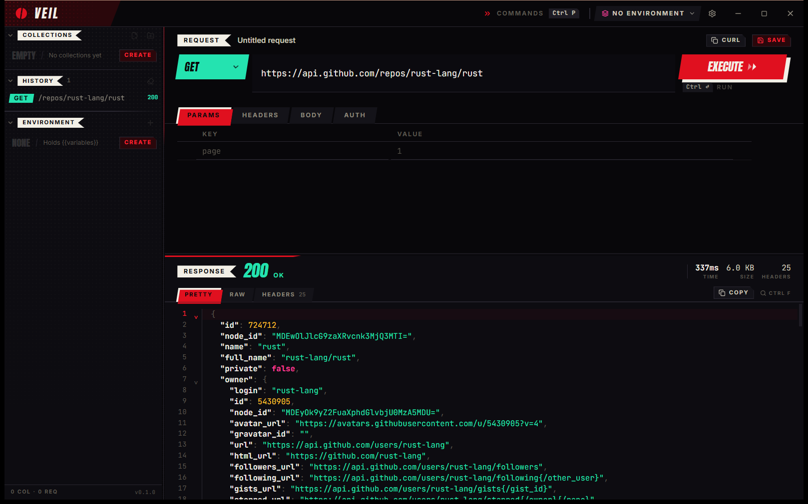
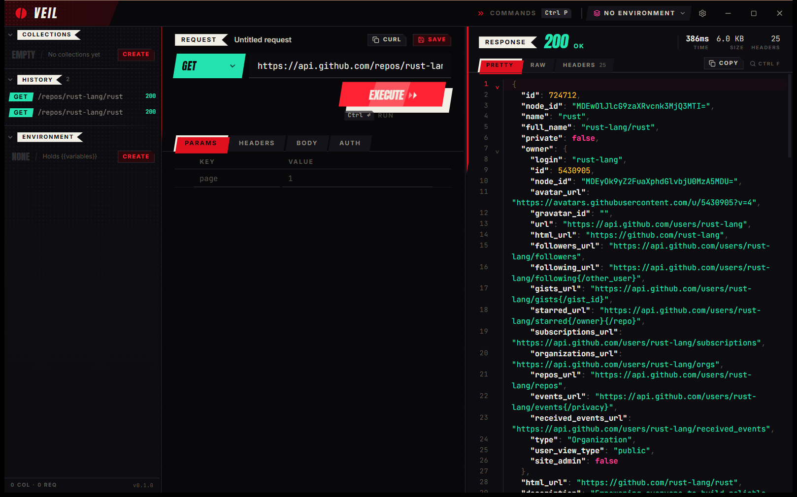

<div align="center">


# VEIL

### A stylish, lightweight API client for developers.

<p>


</p>

</div>

---

Send an HTTP request, read the response, keep the ones that matter. That's it.

VEIL is a desktop API client for people who spend their day inside one — and who
would rather not stare at another grey admin dashboard while doing it. It is
small, fast, offline, and it looks like something.

<br />

<div align="center">
  
  <p><em>Response below — the default. Wide bodies, tall JSON.</em></p>
  <br />
  
  <p><em>Response to the right — request and result side by side.</em></p>
</div>

<br />

## Why VEIL

**It's tiny.** A 3.8 MB installer and a single native binary. No bundled browser,
no background services, no sign-in wall. It starts instantly and stays out of
memory's way.

**It's yours.** Everything lives in a local SQLite file on your machine.
No account, no cloud, no telemetry. Tokens you mark as secret go into the
operating system's own credential store — never into a config file.

**It's fast to drive.** `Ctrl+Enter` sends. `Ctrl+P` opens a command palette for
everything else. You can work through a whole session without reaching for the
mouse.

**It has a face.** High contrast, hard diagonals, condensed display type. Black,
bone white, and one crimson that only ever means *action* — never decoration.
Code and values stay in a proper monospace, because legibility is not something
to trade for style.

**It's small on purpose.** Requests, collections, history, environments. There is
nothing to configure before you can send something.

## What it does

- **Requests** — GET, POST, PUT, PATCH, DELETE, HEAD, OPTIONS
- **No scheme needed** — type `api.example.com/users`; VEIL fills in `https://`,
  or `http://` when the host is local. It shows you which before sending
- **Query params & headers** — toggle rows on and off without deleting them
- **Bodies** — JSON or raw text, with syntax highlighting and formatting
- **Auth** — basic and bearer, masked by default
- **Collections** — save and organise the requests you keep coming back to
- **History** — every request you've run, restorable in one click
- **Environments** — `{{base_url}}/users/{{user_id}}`, resolved at send time
- **Secrets** — stored in the OS keyring, never in the workspace file
- **Two layouts** — response below, or response to the right
- **Copy as cURL** — the exact request that went out, not an approximation
- **Response viewer** — status, timing, size, headers, pretty or raw, searchable

## Install

Download from [**Releases**](../../releases).

| Platform          | File                                                     | Size    |
| ----------------- | -------------------------------------------------------- | ------- |
| Windows 10/11     | `VEIL_0.1.0_x64-setup.exe`                                | 3.7 MB  |
| Windows 10/11     | `VEIL_0.1.0_x64_en-US.msi`                                | 4.4 MB  |
| Debian · Ubuntu   | `VEIL_0.1.0_amd64.deb`                                    | 4.4 MB  |
| Fedora · RHEL     | `VEIL-0.1.0-1.x86_64.rpm`                                 | 4.4 MB  |
| Any Linux distro  | `VEIL_0.1.0_amd64.AppImage`                               | 79 MB   |
| Arch · Manjaro    | [`packaging/arch/PKGBUILD`](packaging/arch/PKGBUILD)      | source  |

```bash
# Debian / Ubuntu
sudo apt install ./VEIL_0.1.0_amd64.deb

# Fedora
sudo dnf install ./VEIL-0.1.0-1.x86_64.rpm

# Any distro
chmod +x VEIL_0.1.0_amd64.AppImage && ./VEIL_0.1.0_amd64.AppImage

# Arch
cd packaging/arch && makepkg -si
```

All of them install a `veil` binary. The AppImage is the outlier on size because it
carries its own GTK and WebKit runtime — the native packages link against the ones
your system already has.

On Linux, secret storage uses the Freedesktop Secret Service, so keep a keyring
daemon around — `gnome-keyring` or `kwallet`. Without one, secrets stay in memory
for the session only.

## Shortcuts

| Keys         | Action          |
| ------------ | --------------- |
| `Ctrl+Enter` | Execute request |
| `Ctrl+S`     | Save request    |
| `Ctrl+P`     | Command palette |
| `Ctrl+L`     | Focus URL       |
| `Ctrl+H`     | Toggle history  |
| `Ctrl+N`     | New request     |

## Built with

**Rust** for the shell, the HTTP engine and storage — [Tauri 2](https://tauri.app),
[reqwest](https://github.com/seanmonstar/reqwest), [rusqlite](https://github.com/rusqlite/rusqlite),
[keyring](https://github.com/hwchen/keyring-rs).

**TypeScript** for the interface — [React 19](https://react.dev),
[Vite](https://vite.dev), [Tailwind CSS 4](https://tailwindcss.com),
[CodeMirror 6](https://codemirror.net).

Every request is executed by Rust, not by the webview, so the interface has no
network permission of its own.

## Status

**v0.1.0 — early access.** The core loop is done and stable: send, read, save,
reuse. The interface is where the work went.

Windows is packaged and tested. Linux bundles build from the same tag in CI.
macOS is not packaged yet.

Not here yet, and honestly not soon: GraphQL, WebSockets, plugins, pre-request
scripting, team sync. VEIL is meant to stay a small tool.

## Building from source

```bash
npm install
npm run tauri:dev      # run it
npm run tauri:build    # produce installers
```

Needs Node 20+, the Rust toolchain, and your platform's build tools — MSVC on
Windows, `libwebkit2gtk-4.1-dev libgtk-3-dev librsvg2-dev patchelf` on
Debian/Ubuntu.

## License

MIT — do what you like. See [LICENSE](LICENSE).

<div align="center">
<br />
<sub>The mark is a single disc parted by one leaning slit — the veil, drawn back.</sub>
</div>
